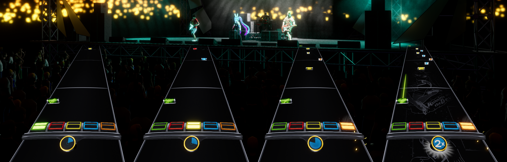
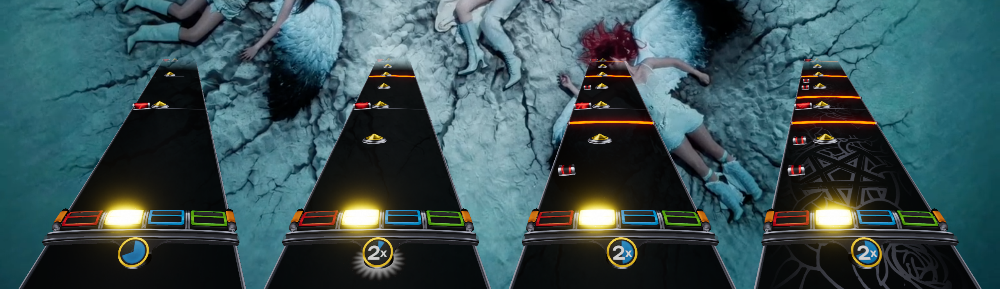
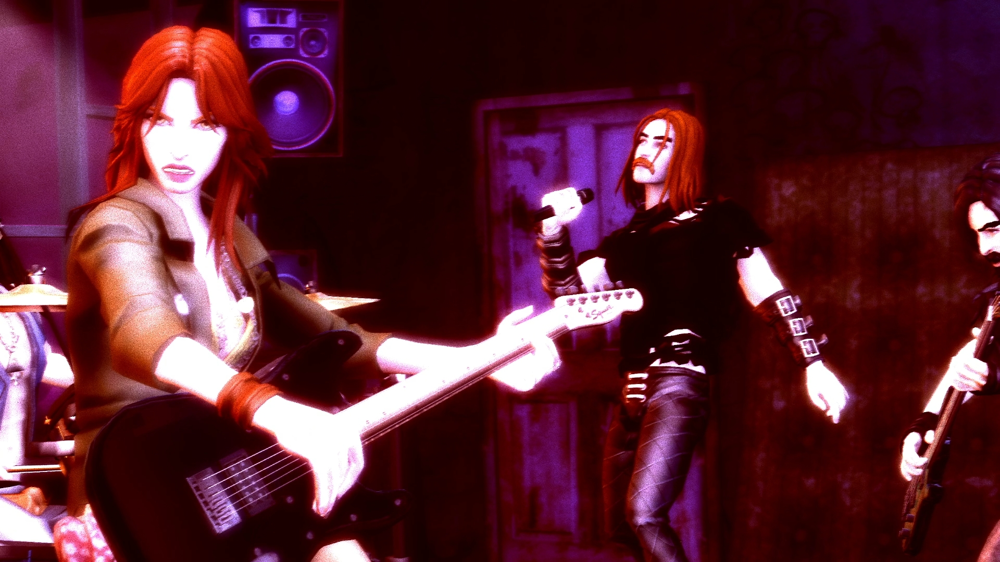
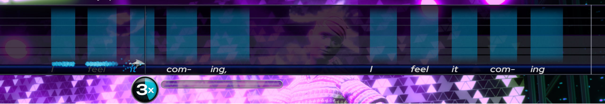

<p align="center">
  
</p>

# Downcharter+

<p align="center">
  <a href="https://github.com/sammymuse/Downcharter/releases/latest"></a>
  <a href="LICENSE"></a>
  
  
</p>

Chart reducer and venue/talkies generator for [YARG](https://yarg.in/), [Rock Band 3](https://en.wikipedia.org/wiki/Rock_Band_3) and [Clone Hero](https://clonehero.net/).

Most customs ship with only an Expert chart. Downcharter+ takes that `.mid` or
`.chart` and fills in the rest: the lower difficulties for every instrument, a
venue with camera and lights, character animations, and talky vocals from the
lyrics.

What it covers:

- Difficulty reduction for guitar, bass and keys — Hard, Medium and Easy
- Drum reduction across all three difficulties, plus Expert+ (2× kick) detection
- Venue generation — camera cuts, lights, post-processing and animations
- Talkies charted from the lyrics
- Optional audio analysis to refine section dynamics and confirm vocal sustains

The reductions try to stay close to what a human charter would do — they keep the
groove and the riff intact instead of quantizing everything to a grid, preserve
sustains and pitch contour, and keep the BEAT track running to the end so the
characters don't freeze mid-song.

---

## Guitar & Drum reductions

Difficulties are worked out from the beat grid rather than hard-coded for a given
BPM, and they cascade down from Expert (`Expert → Hard → Medium → Easy`) so each
level stays consistent with the one above it.

**Guitar / Bass / Keys** — pitch contour preserved:



| Difficulty | Rules |
|---|---|
| **Hard** | from Expert · real HOPOs · no green+orange or 3-note chords · sustain gap 1/16 |
| **Medium** | min spacing 1/4 · gap-fill + beat-snap · all strum · sustain gap 1/4 |
| **Easy** | min spacing dotted-1/4 (1.5 beat) · no chords · all strum · sustain gap 1/4 |

**Drums** — groove-preserving:



- Kick / snare / pad thinning on an adaptive grid, fills collapsed per difficulty
- Doubles preserved · 3+ fast kicks → alternating = Expert+
- A **groove-check** quality guard flags any reduction that loses the feel (logged to a session file)

---

## Venue generation



▶️ **[Watch the full demo](https://youtu.be/stHylYlXqAs)**

Generates camera cuts, lights, post-processing and character animations, with a
theme chosen to fit the song. The camera won't point at an instrument that isn't
playing, and the cuts follow the energy of each section. If a song already has a
hand-authored venue, it's left alone.

If audio is present (`.ogg`, `.opus`, `.wav`, `.flac`, `.mp3`, `.mogg`), it's used
to read the actual loudness of each section — a loud chorus vs. a quiet verse —
which feeds the cuts and lights.

---

## Talkies generation



Charts unpitched (talky) vocals in `PART VOCALS` straight from the lyrics, so the
characters sing and lip-sync even on songs that only have lyrics and no vocal
chart. These are real vocal tubes the engine drives from, not just a lipsync
track.

Without pitch info, the tricky part is knowing how long each note should last. If
an isolated vocal stem is available, Downcharter+ reads the voice's RMS envelope
and ends each note where the singer actually stops, instead of stretching it
across a silent gap. With no stem it falls back to a geometric estimate from the
spacing between syllables.

A vocal stem is worth having here — that's what makes the sustain trimming work.

---

## Install and use (prebuilt version)

1. Go to **[Releases](../../releases)** and download `Downcharter+.zip`.
2. Unzip it into a folder of your choice.
3. Run **`Downcharter+.exe`** — no Python install needed.

### In the app
1. **Open…** → pick the folder with your charts (subfolders included).
2. Toggle what to generate: Expert+, difficulties (Hard/Medium/Easy), venue, talkies,
   hide in-game background.
3. **Process folder** — originals are backed up as `.bak.mid` / `.bak.chart`.
4. Changed your mind? **Revert** restores the originals.

---

## Run from source

```bash
pip install -r requirements.txt
python main.py
```

Requires Python 3.10+.

---

## Build the `.exe`

```powershell
pip install -r requirements-build.txt
powershell -ExecutionPolicy Bypass -File build.ps1
```

Result:
- `dist/Downcharter+/Downcharter+.exe` — executable + dependencies (onedir)
- `dist/Downcharter+.zip` — ready to publish in Releases

Packaging uses PyInstaller via `downcharter.spec`, which already bundles
soundfile's `libsndfile`.

---

## Structure

```
main.py              GUI (tkinter)
downcharter/         engine package
  processor.py         orchestrates the folder (process_folder / revert_folder)
  guitar.py guitar2.py guitar/bass/keys reduction
  drums.py             drums reduction + Expert+
  venue.py             camera, lights, post-proc, BEAT track, animations
  audio.py             optional audio analysis (RMS / bands / voice activity)
  lipsync.py           talkies from the lyrics
  chart.py             reading .chart → .mid
  midi_utils.py        tempo / MIDI event helpers
downcharter.spec     PyInstaller recipe
build.ps1            build script → dist/
```
